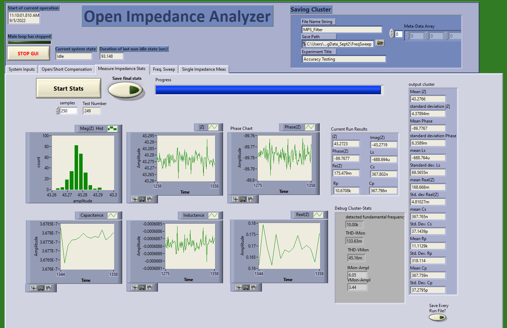
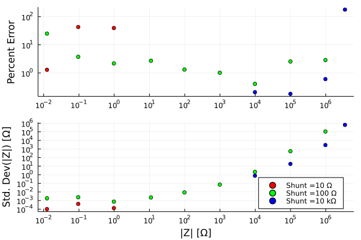
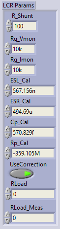
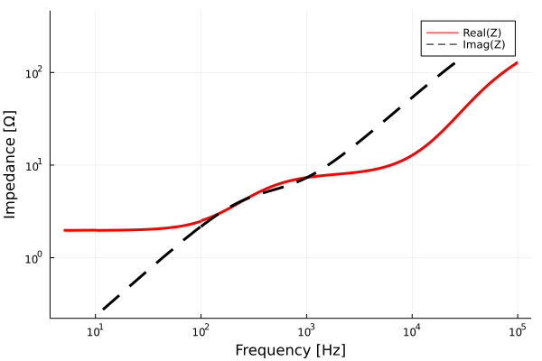

# Simple Impedance Analyzer

## Purpose

The impedance analyzer was designed as a low-cost, flexible, and accurate platform to perform impedance measurement at arbitrary frequencies up to ~250kHz. The current infrastructure assumes the user has access to a National Instruments DAQ (e.g. NI-USB-6363), though similar digitizers would be similarly effective. 

In this current configuration:
* About 0.1% Accuracy for large impedance and frequency ranges.
* The LabView has an easy to use GUI
* TDMS file saving
* It can measure impedances from 10mOhms to 10MOhms, and by changing the shunt resistor values that range could be extended 
* Test at frequencies from DC-250kHz (>100kHz still needs validation)
* Perform frequency sweeps on log or linear spacing
* If a battery-powered computer and DAQ is used, the entire measurement apparatus can be both portable and floating.

### Accuracy and noise (1 kHz resistive)

### Accuracy and noise (10 kHz resistive)

### Accuracy and noise (100 kHz resistive)

### Accuracy and noise (10 kHz Capacitors)

* It seems one can expect about 1% accuracy between 10 p to 0.1 mF. 
* The point indicating 0.01% accuracy is probably spurious. Some random errors happened to offset each others. 

# PCB
Use V2 rev B. V3 has not been tested/built. it is still in design phase. Perhaps it should just be in a separate brach of Github. Designed in KiCAD v6.

# Operating Principle
This circuit uses the "auto-balancing bridge" technique. If you are curious/want to play around with the circuit you can see the LTSPICE schematic. 

It is worth reading the [Keysight impedance measurement handbook](https://www.keysight.com/us/en/assets/7018-06840/application-notes/5950-3000.pdf) or TI's reference design for an LCR meter front-end for an overview of measurement techniques. 

The current through the DUT is (ideally) the same as the current in the shunt resistor, so the impedance is V(DUT) / (V(Shunt)/R(Shunt)). 

# Source of Errors

The precision of the circuit is dominated by the shunt resistors and gain accuracy of the INAs. Error in any of these will linearly cause an error in the calculated impedance. If they are stable over time, they can conceivably be calibrated with a high tolerance (e.g. 0.01%) reference resistor.

If the shunt resistor is off by some value, *X* (where 1.01 would be 1% higher than nominal), the current would be reported as I0**X* where I0 is the actual current. 

The noise performance of the INAs isn't great, but the FET inputs have extremely low bias currents, and low current noise, which are necessary if high impedance loads are attached. The noise should add an incoherent error, so by averaging for longer, this can be mitigated. 

The parasitic elements can be accounted for by taking an open/short/load measurement. See sect. 4.3.2 in the impedance measurement handbook

# Operation instructions
## Setup
The device should be plugged in with a four-wire (Kelvin) probe attached. On the probe there will be two pairs of leads, each connected to a clamp (typically one pair is red, one is black). The two BNC connections on the red lead should be plugged into the "HPot" and "HCur" connectors, and the BNCs on the black probe should be connected to "LPot" and "HPot" connectors. 

Plug in the power and make sure the LEDs next to the "+5V" and "-5V" are illuminated. 

The DAQ should be plugged in via the BNC connectors and however they are connected, those outputs/inputs are selected on the front page of the Labview GUI.

Also on the front page, set the sampling rate to the maximum allowable (see documentation for your DAQ). Set the sampling time to be >10 periods of whatever frequency you are testing at. Longer gives better noise performance.

For the shunt resistor, use the value most similar to the load you are measuring. Use J13/14 to select the shunt resistor. 

Set the series resistor before the load (R9/24) to the same value as the shunt resistor using J17.

* For the saving cluster the Fine Name String will be the identifier in the file name.
* Save path is the directory it will be saved within
* Experiment title is a string added to the metadata
* Meta-data array is an array that the user can fill in as desired. It just goes into meta-data as-is. For example, if you are measuring the turns on an inductor vs inductance, you could enter the turn count in this spot and then afterwards when processing the data it would already be saved. 

* **Test Freq:** This is the measurement frequency for single measurements and stats. It is overwritten for frequency sweeps.
* **Output Signal Amp:** This is the waveform amplitude the DAQ outputs. If this is too low, SNR is sacrificed, if it is too high, the waveform can clip. Check the debugging cluster to ensure the amplitude of the voltage monitor and current monitor arent clipping (i.e. they are less than 7 V or so)
* **Sampling time:** Time of acquisition in seconds. Should be long enough for 10 or so periods of the output waveform. More improves SNR. 
* **Sampling Rate:** Sampling rate in Hz. should be maximum allowable.
* **Output Channel:** The channel that goes into the Voltage Input BNC (top left in photo above)
* **Current Channel:** The channel that comes from the current sense BNC (Bottom left in photo above)
* **Voltage channel:** The channel that comes from the voltage sense BNC (middle left in photo above)
* **Trigger channel:** This should be set to the output start trigger, for example "/Dev2/ao/StartTrigger"
* **Number of runs:** this is the number of times the acquisition will be repeated and averaged.

* **R_Shunt:** The shunt resistor value (R14/18)
* **Rg_Vmon:** The gain-setting resistor for the voltage monitor (R12 or R8) 
* **Rg_Imon:** The gain-setting resistor for the current monitor (R11 or R7) 
* **ESL_Cal:** This value is set by the short circuit compensation and is enabled by the UseCorrection boolean
* **ESR_Cal:** This value is set by the short circuit compensation and is enabled by the UseCorrection boolean
* **Cp_Cal:** This value is set by the open circuit compensation and is enabled by the UseCorrection boolean
* **Rp_Cal:** This value is set by the open circuit compensation and is enabled by the UseCorrection boolean

* **UseCorrection:** enables the short/open compensation values. Typically set to TRUE (green illuminated)

* **RLoad:** This is the actual value of the load compensation resistor that one may use to calibrate gain errors of the system. 

* **RLoad_Meas:** This is the measured value of that load. To acquire this value, set RLoad and RLoad_Meas to 0 and then measure the known load and set this and the RLoad by typing in the appropriate values.

## Calibration

Set the equipment up to measure your load, and short the clips together. Next, go to the Short/Open compensation tab and press the "Acquire short" button. Open the clips and then do the open compensation.

## Measure load

Use the last page to do a single impedance measurement and ensure the load is similar to expected. Then use the stats page or freq sweep depending on what you want. 

## List of jumpers & their purpose
* J15/16 low-pass filters for the input. These clean the analog signal from the DAQ. They can generally be set to the highest frequency that the user plans to measure. Removing the jumper disconnects the filtering entirely.

* J10: The current monitor gain selection
* J12: Voltage monitor gain selection
* J13/14: Shunt resistor selection
* J17: Series resistor selection. This resistor in series with the load helps stability and makes the system more balanced. The resistor value should match the shunt resistor value.

# If you are having errors:
1) Make sure the channels are selected properly
2) Make sure BOTH sides of the clips are on the load
3) Make sure the BNCs are properly attached
4) The LEDs should be illuminated
5) The amplitude should be sufficiently low that it doesn't saturate the inputs/clip

# Example applications:

## Litz wire, air-core inductor

* The impedance is exactly as expected here for an inductor. Because Litz wire was used, the resistance is not a strong function of frequency. 
* The slope of the reactance is constant and proportional to frequency.

## Skin and proximity effect on inductor

This is a frequency sweep of a solenoid (~1 mm diameter) wound on a copper tube with a wall-thickness of ~1 mm. Quite a lot is happening with this load:
* Below 50 Hz or so, it is essentially a resistor, the inductive impedance is very small. 
* At 50-1k Hz, the solenoid's impedance has an increasing real component and decreasing inductance (decreasing slope of imag.). This occurs as the inductor couples more strongly into the copper tube. The inductance decreases because the magnetic field in the center of the tube is decreasing as the wall effectively shields it. 
* Between 1k and 10k Hz the resistance nearly plateaus and the inductance starts rising proportionally to frequency. Presumably at this point, the skin depth of the copper tube has been met, so the magnetic fields are not significantly penetrating to the center of the tube. 
* Above 10 kHz the skin depth of the wire is being reached and the AC-resistance is increasing as the effective copper area for current to flow in decreases.

## Resonant L-C

## Notch filter input

# Thoughts for improvement
* Make the shunt resistor digitally selectable
* Build a microcontroller-based interface for increased portability
* Improve system accuracy for high impedance loads
* Improve system accuracy for high frequencies
* Modify it such that it uses only one amplifier for both VMon and IMon and a relay to select which one. 
* Replace INA121 with a JFET INA (e.g. 3 opamp configuration)
* Implement transformer test jig

